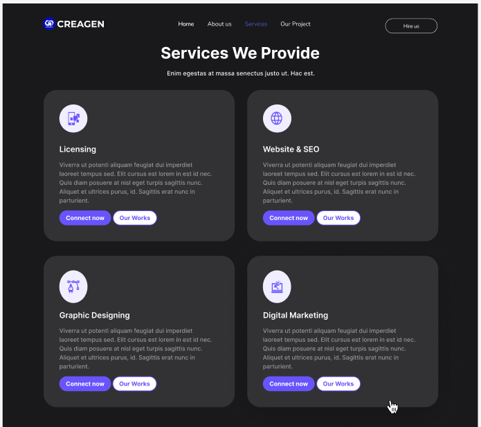

## Hey there 
<a href="https://www.instagram.com/haikalfairuzimaulana_/">
  
</a>


<br />
<br />

Hi, I'm [Haikal](https://www.linkedin.com/in/haikal-fairuzi-maulana-4227ab213/), Junior Web Programmer. Learn very much
of web programming language and curious about new stack of
programming. Experience in freelance and remote work.
Responsible, wondering, and hard working. Client satisfaction is
number one.

  


- 💬 Ask me about anything, Let we discuss together!
- 📫 Reach me at <i>karl.391.east.kn@gmail.com</i>

**Languages and Tools:**  

<code></code>
<code></code>
<code></code>
<code></code>
<code></code>
<code></code>
<code></code>

📊 **Quote Of The Day is:**
<!--START_SECTION:waka-->
```text
No Bug No Life.
```
<!--END_SECTION:waka-->

</p>
<p align="left"> <a href="https://github.com/ryo-ma/github-profile-trophy"></a> </p>

📈 My GitHub Stats

<table border="0" align="center">
<tr border="0">
<td width="50%" align="center">
  
  
  <br></br>
  

</td>

<td width="50%" align="center">

  
  
  </td>
</tr>
</table>

<p  align="center">
</p>

<h3 align="left">Connect with me:</h3>
<p align="left">
<a href="https://twitter.com/haikalfairuzim" target="blank"></a>
<a href="https://www.linkedin.com/in/haikal-fairuzi-maulana-4227ab213/" target="blank"></a>
<a href="https://instagram.com/haikalfairuzimaulana_" target="blank"></a>
<a href="https://medium.com/@karl.391.east.kn" target="blank"></a>
</p>

Figma Portofolio Website : https://www.figma.com/design/kUbbmwH0AZ7P2x6Kb3yViu/Portofolio-web?node-id=0-1&t=RTRIF6iZ4zAnyBvG-1

## 📷 Images of the website

### Home Page
  


### Projects Page


### Contact Page


